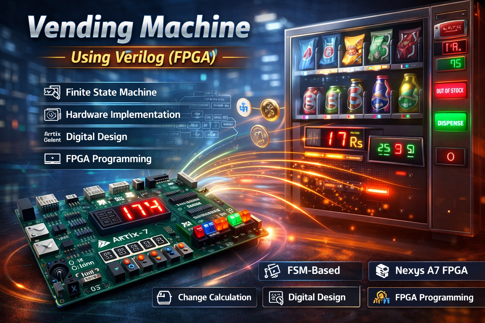

# 🏪 Vending Machine Using Verilog (FPGA)

A **Finite State Machine (FSM)–based vending machine system** designed and implemented using **Verilog HDL** on an **FPGA platform (Nexys A7)**. The system supports **product selection, money insertion, item dispensing, change calculation, refund processing, out-of-stock detection, and system reset**, demonstrating a complete hardware-level vending machine prototype.

---

## 📌 Project Overview

Conventional vending machines often require exact change and lack flexibility in handling refunds or stock conditions. This project addresses these limitations by designing a **robust FPGA-based vending machine** that accurately manages user transactions using **FSM methodology**.

The system accepts **₹1, ₹2, and ₹5 coins**, supports **five products**, and uses **seven-segment displays** to show product prices, inserted money, and change. The entire design is modeled, simulated, and verified using **Verilog HDL** and FPGA development tools.

---

## 🎯 Objectives

- Design a vending machine using **FSM methodology**
- Implement reliable **product selection and dispensing**
- Support **change calculation and refund**
- Detect and handle **out-of-stock conditions**
- Ensure accurate input handling using a **clock divider**
- Validate functionality via simulation and FPGA implementation

---

## 🧠 Key Features

- 🧩 FSM-based sequential control logic  
- 💰 Accepts ₹1, ₹2, and ₹5 denominations  
- 🔄 Automatic change calculation  
- ↩️ Refund option before dispensing  
- 📦 Out-of-stock detection  
- 🔢 Seven-segment display interface  
- ⚡ Implemented on **Nexys A7 FPGA**

---

## ⚙️ System Architecture

**User Inputs → FSM Controller → Dispense / Change / Refund Logic → Seven-Segment Display**

The FSM governs all transitions between operational states to ensure deterministic and reliable vending behavior.

---

## 🧩 Hardware Platform

- **Nexys A7 FPGA Board (Artix-7)**
- Seven-segment display
- Push buttons / switches
- On-board clock (100 MHz)
- Power & I/O interfaces

---

## 💻 Software & Tools Used

- **Verilog HDL**
- **Xilinx Vivado**
- **Xilinx ISE Simulator**
- FSM-based RTL design
- Testbench-driven simulation

---

---

## 🔄 FSM States

1. **Reset State**  
2. **Product Selection State**  
3. **Money Amount State**  
4. **Dispense Item State**  
5. **Change State**  
6. **Refund State**  
7. **Stock State**

State transitions are governed by product availability, inserted money, and user actions, ensuring correct vending behavior.

---

## 🧪 Results & Validation

- Verified using **Xilinx ISE simulation**
- Correct operation under:
  - Exact payment
  - Excess payment (change dispensed)
  - Insufficient payment
  - Refund request
  - Out-of-stock condition
- Successful **hardware demonstration on Nexys A7**

---

## 🚀 Applications

- Automated vending systems  
- FPGA-based embedded controllers  
- FSM design case studies  
- Digital system design education  

---

## 🔮 Future Scope

- Touchscreen-based user interface  
- Contactless / mobile payments  
- Real-time inventory monitoring  
- Data analytics for usage patterns  
- Smart vending with IoT integration  

---

## 📄 Research Reference

This project is based on the IEEE conference paper:

“Vending Machine Using Verilog (FPGA)”
4th Asian Conference on Innovation in Technology (ASIANCON 2024)
Vishwakarma Institute of Technology, Pune
🔗 https://ieeexplore.ieee.org/abstract/document/10838215

## 📜 License

This project is intended for **academic and research purposes**.  
Free to use with proper attribution.

---

⭐ If you find this project useful, consider starring the repository!

